# NFC Tutorial
<i>A full practical guide for classic MIFARE tags</i>

## 1 Introduction

NFC (Near-Field Communication) is a variety of communication protocols between two electronic devices over a short distance, usually less than 4cm [[source]](https://en.wikipedia.org/wiki/Near-field_communication). We usually know NFC as a helpful technology when it comes to access control or contactless payment like [Google Pay](https://pay.google.com/about/) or [Apple Pay](https://www.apple.com/apple-pay/). There are a lot of different usecases where NFC is applied, and there is also a large variety of protocol standards. A very famous and wide-spread standard is the [MIFARE Classic](https://www.mifare.net/en/products/chip-card-ics/mifare-classic/). An advantage of MIFARE tags is that they are incredibly cheap and can be read by all possible devices. A drawback is that this protocol is very well examined and is no longer secure. In case you want to use NFC tags for storing confidential information, it is a very bad choice to use MIFARE tags. There are better and more secure tags available, such as [NTAG215](https://www.nxp.com/products/rfid-nfc/nfc-hf/ntag-for-tags-and-labels/ntag-213-215-216-nfc-forum-type-2-tag-compliant-ic-with-144-504-888-bytes-user-memory:NTAG213_215_216) tags. Although newer and better standards already exist, MIFARE tags are still used by a large number of companies and facilities.<br><br>
In this tutorial I will explain how to work practically with MIFARE tags. We will learn how to set up a DIY tag reader and writer device, what MIFARE tags to use, how to manipulate contents of a tag, and how to create fancy contact tags that can be read by all kinds of smartphones, including [Apple's iPhones](https://www.apple.com/iphone/).

## 2 DIY NFC Reader/Writer
### 2.1 Required Hardware and Materials
Let us start with some important physical requirements. Here is a list of hardware that we will use in this tutorial:
 * A Raspberry Pi Zero 2W with case and GPIO pins soldered
 * A case for your Raspberry Pi
 * An iPhone with mobile internet access and NFC capability (iPhone 6 and newer)
 * A computer/laptop of your choice
 * A 32GB nano SD card with suitable adapter for your computer
 * A power adapter with micro-USB (male)
 * A PN532 reader/writer module with pins soldered
 * Six female-to-female jumper wires (>10cm recommended)
 * A paper clip
 * A USB-A (female) to micro-USB (male) adapter
 * An iPhone wire that has a USB-A (male) connector
 * A powerbank (5V~1,2A with 10,000mAh recommended)
 * A wire with micro-USB (male) and an end that fits your powerbank
 * A wireless home network (2.4GHz)
 * Blank MIFARE tags of your choice
 * At least one new MIFARE chinese clone tag with changeable UID
 * A soldering kit

### 2.2 Hardware Setup 
With everything at hand, let's start with the Raspberry Pi. Such set costs about 40 EUR (May 2024). I recommend [this seller on Amazon](https://www.amazon.de/stores/page/DDE68FC9-D2C7-464C-86A6-40A35B195E1B). The PN532 module comes usually with pins, MIFARE tags, and jumper wires. You can order it from [AliExpress](https://www.aliexpress.com/w/wholesale-pn532.html?spm=a2g0o.detail.search.0). There is a wide range of offers, find one that you like. One important thing to mention is that most times the seller includes only 4 jumper wires. If you use the [I2C protocol](https://en.wikipedia.org/wiki/I%C2%B2C) it works with only 4. However, using 6 together with the [SPI protocol](https://en.wikipedia.org/wiki/Serial_Peripheral_Interface) singificantly increases operating speed which will be extremely important when running key recovery later. Therefore I recommend to find a seller that will send you 6 or buy jumper wires on [AliExpress](https://www.aliexpress.com/w/wholesale-jumper-wire.html?spm=a2g0o.productlist.search.0). If you have no soldering kit at home, consider buying [this one](https://aliexpress.com/item/1005006842091809.html).<br>

Now that we have everything, let us begin with the hardware preparation. Solder the GPIO pins to the Raspberry Pi, install the case, and solder the pins on the PN532 chip. Now grab your jumper wires and connect the PN532 module to the Raspberry Pi as shown below:<br>
<a name="wiring"><p align="center">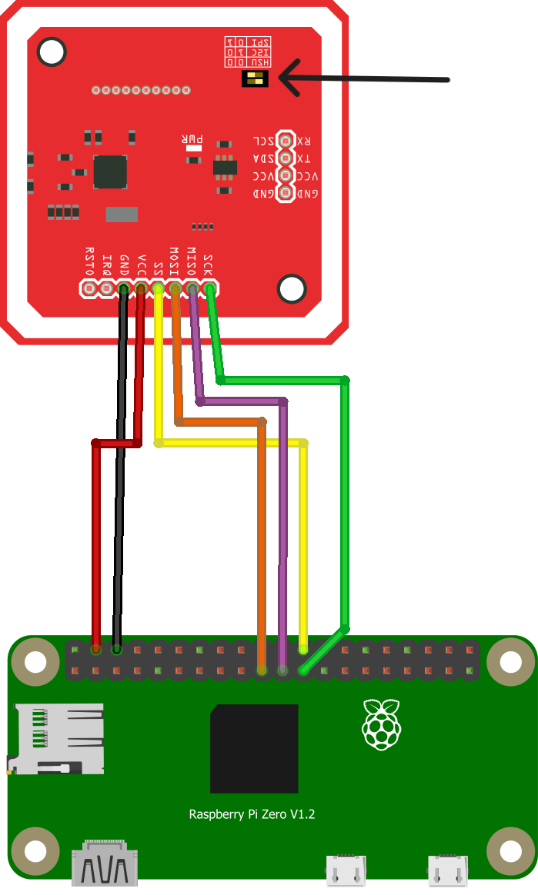</img></p></a>

Note that you have to change the position of the onboard switches to set the PN532 module to SPI. The black arrow in the image points on the switch block. The light yellow color in the diagram switch block is the switch position. First, remove the foil that is usually above the switches on new modules, then, with help of a paper clip, change the position of the switch. <b>Be careful, don't apply too much force!</b> Now check if you unplugged your soldering iron and continue with the software part.

### 2.3 Operating System Setup

Now to install the right operating system (OS) we have to download the [Raspberry Pi Imager](https://www.raspberrypi.com/software/). Open it on your PC and plug in your SD card. Now, select the device, in our case Raspberry Pi Zero 2W. For operating system, go to "Raspberry Pi OS (other)" > "Raspberry Pi OS Lite (32bit)". In storage part, select your SD card that you have plugged in before. Hit "NEXT". Now choose "EDIT SETTINGS". Here you can select a name for your Raspberry, your username and password, and set up your WiFi home network. Make sure you fill in the correct SSID and PSK (WiFi name and password), else you will have to do everything all over again. It should look something like this:<br>
<a name="configurationOS"><p align="center">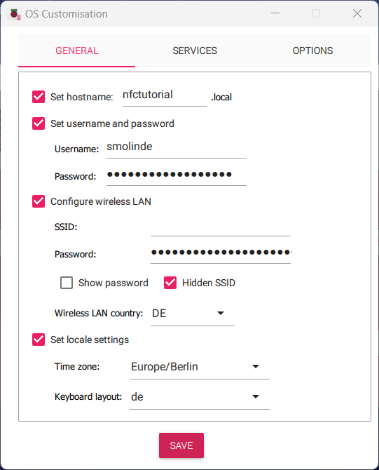</img></p></a>

Hit "SAVE" and then "YES", and again "YES". At this point, say goodbye to everything that was stored previously on the SD card and wait until the program finishes the flash process. After termination, plug out the SD card and plug it into the Raspberry Pi. Now if you recall the [wiring diagram](#wiring), plug in your power supply into the <b>micro-USB port on the right!</b> The left port is for data transfer. Wait a few minutes. A green LED should be flashing in your Raspberry Pi and a red LED should be shining on the PN532 module. Make sure your computer is connected to the same network as your Raspberry Pi. Open a command line of your choice (I prefer using [Microsoft PowerShell](https://learn.microsoft.com/en-us/powershell/)). Now, let's take the credentials that I've chosen in [my configuration](#configurationOS) and try to connect the very first time via [SSH](https://en.wikipedia.org/wiki/Secure_Shell):

<a name="loginCommand">

		ssh smolinde@nfctutorial.local

</a>

The shell will prompt some security information. Ignore it, type in "yes" and hit <kbd>ENTER</kbd>. Now type in your password. Don't worry, although no letters appear on the screen, you are typing. After entering the password, hit <kbd>ENTER</kbd> again. Your screen should look something like this:<br>
<a name="firstShellLogin"><p align="center">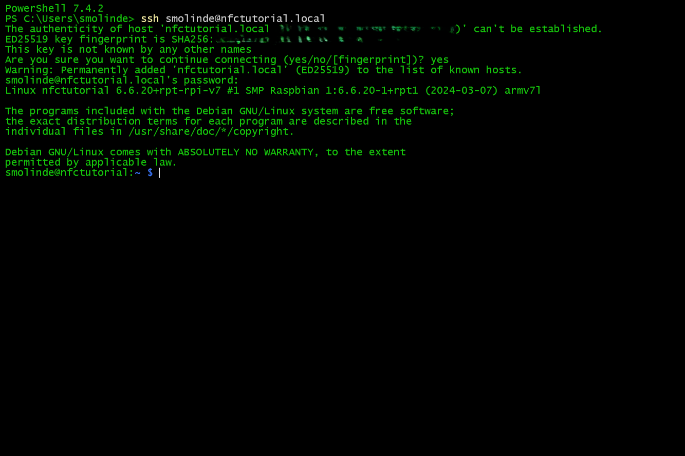</img></p></a>

Congratulations! You have now a running omnipotent computer.

### 2.4 Raspberry Pi Configuration
Before installing all required components to work with NFC tags we first have to do some steps to ensure that the Raspberry Pi is set up correctly to work as expected. A golden rule is to run the following command right after the first login:

		sudo apt update -y && sudo apt full-upgrade -y

Wait until the updates are installed. Now we have to do the following things:
* Enable SPI
* Expand file system
* Create a Hotspot
* Add 4GB of SWAP memory

Type the following command in your command line and hit <kbd>ENTER</kbd>:

		sudo raspi-config

With arrow keys, navigate to "3 Interface Options", hit <kbd>ENTER</kbd>, navigate to "I3 SPI", and hit <kbd>ENTER</kbd> again. Select "\<Yes\>", hit <kbd>ENTER</kbd> two times. Now navigate to "6 Advanced Options", hit <kbd>ENTER</kbd>, now you should select "A1 Expand Filesystem" with <kbd>ENTER</kbd> again. Wait a little bit, hit <kbd>ENTER</kbd> after the file system was resized. Now hit the <kbd>TAB</kbd> key two times and <kbd>ENTER</kbd> to finish, save, and close Raspberry Pi configuration GUI. It will ask you whether you would like to reboot, hit <kbd>ENTER</kbd> to do so. Now wait a few moments until the Raspberry Pi reboots. Repeat the [login command](#loginCommand). Now we are going to set up the wireless hotspot that will be activated when your home network is out of reach. This will allow you to connect to the device anywhere from any device (later more). To do so, run the following command and replace "MyNetworkName" and "MySecurePassword" with a WiFi network name and a password of your choice:

<a name="hotspotSetup">

		sudo nmcli dev wifi hotspot ifname wlan0 ssid "MyNetworkName" password "MySecurePassword"

</a>

The shell will disconnect immediately. Go to your computers WiFi settings, find the new network, and connect with the chosen password. After this, run the [login command](#loginCommand) in your command line again. Now you can run:

		sudo nmcli con edit Hotspot

Inside of here, run the following commands:

		set connection.autoconnect yes
		set connection.autoconnect-priority -10
		set 802-11-wireless.hidden yes

Now type and run "save", type "yes" if asked, and "quit" to leave editing window. Now run:

		sudo nmcli con mod "preconfigured" connection.autoconnect-priority 10

This ensures that your home WiFi will be preferred and the Hotspot will be activated if and only if there is no other network in reach. You have to do this only once unless you decide to change your WiFi network properties. In that case you can always edit the existing connection (e.g. changing the password). I also recommend to hide the hotspot so that if you are using it somewhere else, people will not really see the additional existing network that is broadcasted by your Raspberry Pi. Now for key recovery we have to add a bit of RAM to our system, which is possible with [SWAP memory paging](https://en.wikipedia.org/wiki/Memory_paging). Run the following commands:

		sudo fallocate -l 4G /swapfile
		sudo chmod 600 /swapfile
		sudo mkswap /swapfile
		sudo swapon /swapfile

Now also edit the following configurato file with [nano](https://en.wikipedia.org/wiki/GNU_nano):

		sudo nano /etc/fstab

At the bottom of this file, paste the following line:

		/swapfile swap swap defaults 0 0

Press <kbd>CTRL</kbd>+<kbd>O</kbd>, <kbd>ENTER</kbd>, and then <kbd>CTRL</kbd>+<kbd>X</kbd> to save and close the file. Now also open the following file:

		sudo nano /etc/sysctl.conf

At the bottom of this file, paste the following line:

		vm.swappiness=100

Press <kbd>CTRL</kbd>+<kbd>O</kbd>, <kbd>ENTER</kbd>, and then <kbd>CTRL</kbd>+<kbd>X</kbd> to save and close the file. Reboot the Raspberry Pi via:

		sudo reboot now

Wait until the process is finished and continue with the software setup section. Don't forget to connect your PC back to your home WiFi network.

### 2.5 Software Setup
For now, we have successfully prepared the hardware and Raspberry Pi configurations. Now we have to install and configure software components that we will use throughout this tutorial. The following command will do most of the work:

<a name="installEverything">

		sudo apt install screen git apache2 hexcurse autotools-dev autoconf libtool libusb-dev liblzma-dev ipheth-utils -y

</a>

After installing all new components we will start with installation of [libnfc](https://nfc-tools.github.io/projects/libnfc/). This is an open-source library that allows us to work with NFC tags. Download the repository and go inside of the downloaded folder:

		git clone https://github.com/nfc-tools/libnfc.git && cd libnfc

As this is a repository with source code we have to configure, build, and install the software. To do so, run these commands one after each other:

		autoreconf -vis
		./configure --prefix=/usr --sysconfdir=/etc
		make
		sudo make install

After installation we need to grant ourselves permissions to access the NFC drivers. We can do so by copying a file to the [udev](https://en.wikipedia.org/wiki/Udev) rules folder:

		sudo cp contrib/udev/93-pn53x.rules /lib/udev/rules.d/

Create a new folder called "nfc" inside the [/etc](https://en.wikipedia.org/wiki/Filesystem_Hierarchy_Standard) directory and copy the sample configuration file from the repository to it:

		sudo mkdir /etc/nfc
		sudo cp libnfc.conf.sample /etc/nfc/libnfc.conf

Open the copied configuration file with nano:

		sudo nano /etc/nfc/libnfc.conf

At the bottom of this file, paste the following two lines:

		device.name = "PN532 Reader (SPI)"
		device.connstring = "pn532_spi:/dev/spidev0.0:50000"

Press <kbd>CTRL</kbd>+<kbd>O</kbd>, <kbd>ENTER</kbd>, and then <kbd>CTRL</kbd>+<kbd>X</kbd> to save and close the file. The previous step ensures that the libnfc tools find the SPI hardware address of the PN532 module and are able to communicate through this channel. At this point it makes sense to check whether we can actually access and use the PN532 module. To do so, run the following command:

		nfc-scan-device

The output should look something like this:

		nfc-scan-device uses libnfc libnfc-1.8.0-72-gdf0a3be
		1 NFC device(s) found:
		- PN532 Reader (SPI):
    		pn532_spi:/dev/spidev0.0:50000

The version of your libnfc installation might be different. If you see this output, then everything works as expected and soon you will be able to run your very first read/write commands! If the output yields errors or something else, go through all previous steps I have described so far or open [here](https://github.com/smolinde/nfc-tutorial/issues/new) an issue if you are really stuck. Else continue with the installation of the key recovery tool. Return to your home directory and run the following commands one after another:

		cd
		git clone https://github.com/nfc-tools/mfoc-hardnested.git && cd mfoc-hardnested
		autoreconf -vis
		./configure
		make
		sudo make install
		cd

These commands will download, build, and install the desired recovery tool called [mfoc-hardnested](https://github.com/nfc-tools/mfoc-hardnested). At this point it is time for a legal disclaimer:

<a name="legalDisclaimer"></a>

<b>THE METHODS PRESENTED BELOW ARE ONLY TO BE USED WITH OWN TAGS AND SHALL NEVER BE USED TO GAIN ILLEGAL ACCESS TO INFORMATION STORED ON TAGS THAT BELONG TO OTHERS THAN YOU. THE AUTHOR OF THIS TUTORIAL DOES NOT CARRY ANY RESPONSIBILITY IF THE BELOW LISTED METHODS ARE APPLIED IN UNLAWFUL WAYS. USE WITH CAUTION. USE AT YOUR OWN RISK AND INFORM YOURSELF ABOUT LOCAL LEGAL REGULATIONS.</b>


With this being said, we can now have a deeper look into the methods of how to read, write, format, and recover MIFARE classic tags.

## 3 Basic NFC Knowledge

### 3.1 Types of Tags
Before we begin to explore various commands, let's have a look at what types of tags exist out there. The MIFARE classic tag usually can store 1024 [bytes](https://en.wikipedia.org/wiki/Byte) of data and is therefore called 1K tag. There are also tags that can store 2K or even 4K of information, but they are hardly ever used because the information stored on such tags is most of the times very compact and takes only a small percentage of the whole capacity of a 1K tag. These tags are manufactured in a large variety of forms, such as classic credit card sized tags, stickers, bracelets, keyrings, wearable rings, and many more. The image below shows my collection of tags:
<a name="tagCollection"><p align="center">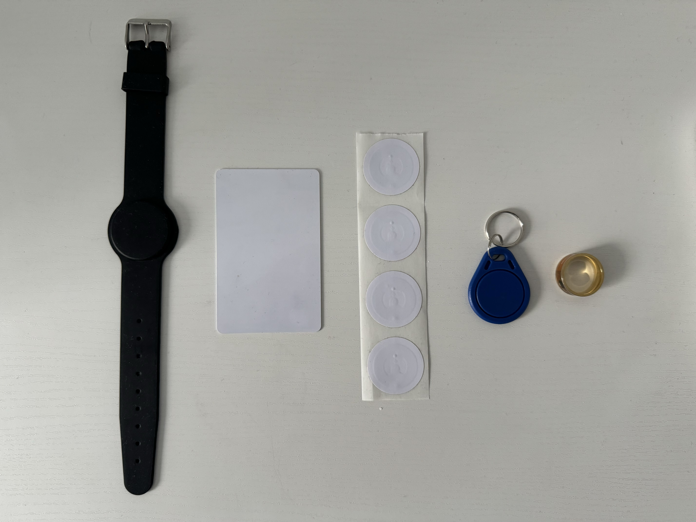</img></p></a>

A questions that begs to be answered now is how do systems distingush the tags one from another. Here is an example; Assume you have a key tag that allows you to open a [NFC drawer](https://aliexpress.com/w/wholesale-nfc-drawer-lock.html?spm=a2g0o.home.search.0) at your home. How to ensure that if you clone a tag the drawer mechanism is still able to recognize that the presented key tags is a clone and not the original? The answer to this question is a bit complicated, so let me break it down into a few bullet points:
* Each classic tag has a unique manufacturer ID assigned to it
* This ID cannot be modified
* Additionally to the ID there is even more unchangeable data
* This makes tags very distinguishable
* If the ID is 4 [hex](https://en.wikipedia.org/wiki/Hexadecimal) bytes long, there are 256<sup>4</sup> = 4,294,967,296 different ID's
* This is roughly one tag per two people on this planet (2024)
* If the ID is 7 hex bytes long, there are 256<sup>7</sup> = 72,057,594,037,927,936 different ID's
* This is quite a lot and would really solve the uniqueness issue
* There are so-called [Chinese clone tags](https://aliexpress.com/w/wholesale-chinese-clone-cards.html?spm=a2g0o.productlist.search.0) that allow to write any ID onto the tag
* This mechanism completely destroys the uniqueness of tags
* This issue can be partially circumvented by readers by checking if the ID is rewritable
* There are tags that can get any chosen ID that cannot be changed afterwards
* The uniqueness of MIFARE tags is therefore not existing

I think this is an interesting observation. It reflects the human spirit of circumventing anything that was invented for a good purpose.

### 3.2 Data Storage and Structure
To better understand what actually is inside the tag we will talk about a bunch of terms:
* Constant and rewritable UID
* Sector
* Block
* Key A and key B
* Access bits
* Sector trailer

There are many more terms like BCC, SAK, ATQA, etc. We will only use the very basic terminology to keep things as easy as possible. Before I start to explain what each term means, let's have a look on an example of how data on a 1K chip actually looks like. To do so, go back to you Raspberry Pi, log in, and run the following command:

		mkdir nfc && exit 0

On your "Desktop" environment you just created a folder called "nfc". Inside of this folder you can store any NFC-related material to avoid chaos. Now donwload the two files [blank.mfd]() and [blank_iPhone.mfd]() that are provided in the folder [nfc-templates]() of this repository. We will use the [scp](https://en.wikipedia.org/wiki/Secure_copy_protocol) command that allows you to transfer files from A to B securely. Inside your command line, run the following commands and replace the information so that it aligns with your data paths, Raspberry Pi username, and password:

		scp "Your/Path/To/blank.mfd" yourusername@yourhostname.local:/home/yourusername/nfc
		scp "Your/Path/To/blank_iPhone.mfd" yourusername@yourhostname.local:/home/yourusername/nfc
		scp "Your/Path/To/sample_with_keys.mfd" yourusername@yourhostname.local:/home/yourusername/nfc

All three times you will be asked to type in your password. This is what we also have done. Now, [log in](#loginCommand) back to your Raspberry Pi, navigate inside the "nfc" folder, and open the blank dummy file:

		cd nfc
		hexcurse -r 16 blank.mfd

You should see now something like this:
<a name="hexcurseBlankTag"><p align="center">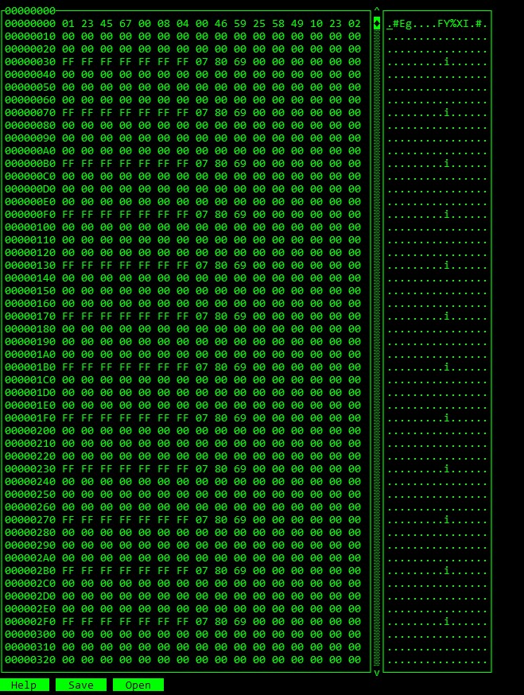</img></p></a>

The beauty of [hexcurse](https://github.com/LonnyGomes/hexcurse) by [Lonny Gomes](https://github.com/LonnyGomes) is that you can write a plaintext in the editor on the right-hand side and it will automatically encode it on the left-hand side to hexadecimal bits. This is also very helpful vice versa, when you open a tag file, you may see encoded information as plaintext. We will try this out later. The ```-r 16``` argument reshapes the file so that exactly 16 bits per row are displayed. Explore the file with up and down arrow keys. The very first line is the block 0, the so-called manufacturer block. Here 01234567 is the 4 byte UID of the chip. That thing is sometimes 7 bytes long. It cannot be really distinguished by just looking at it. But later when reading a chip you will get the UID always displayed separately, so this is how you know then how long the UID actuall is. Further you may observe that there are tons of zeros. That is because the file is a blank tag with almost no content. Why almost? Let's talk about the key blocks and what sectors are. I took an image from a repository by [Pavel Zhovner](https://github.com/zhovner) - [mfread](https://github.com/zhovner/mfdread). Check it out, he has written a nice script for opening tag files that also highlights keys and access bits with colors. Also the repository contains very detailed technical knowledge of the single components inside a tag file.
<a name="sampleFileColored"><p align="center">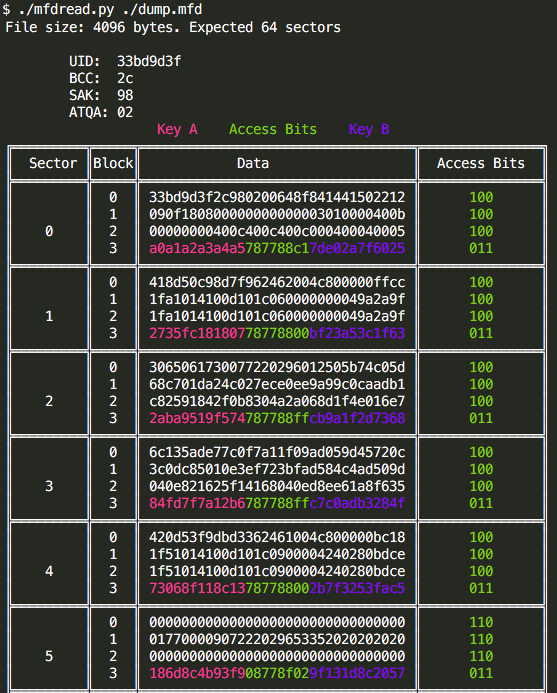</img></p></a>

In the image above we see that a sector contains 4 blocks. There is a total of 16 sectors (0 to 15) inside a MIFARE classic 1K tag and 16 × 4 = 64 blocks (0 to 63) in total. As said previously, block 0 contains the UID and manufacturer data. On regular tags, we cannot change this block no matter what we do. However, if we take a Chinese clone tag, we can rewrite the block 0 as often as we want (later more). In each fourth block we see the so-called sector trailer that contains <span style="color:#F73992">Key A</span>, <span style="color:#7AD109">Access Bits</span>, and <span style="color:#5717F7">Key B</span>. The access bits are there to tell the reader what it can or can't do with the sector. Note that only the first three hex bits are used for access condition encoding, the last bit can be set to anything (user bit). The keys on the other hand may or may not be required to either read or write to the single blocks of a sector. You can set the access bits very individual depending on your usecase. For example, if you want to create a sector that shall be read-only with both keys at hand, your access condition would be <span style="color:#7AD109">70F87800</span>. Key A and Key B can be generated randomly. The calculation of access bits is described in the [NXP official documentation](https://www.nxp.com/docs/en/data-sheet/MF1S50YYX_V1.pdf). To avoid reading this document and calculating the access bits by hand we will install an access bits calculator in the next chapter.
### 3.3 Access Bits Calculator
Close the hexcurse editor with <kbd>CTRL</kbd>+<kbd>X</kbd>. Navigate back to your home directory and download the [MIFARE Classic 1K Access Bits Calculator](https://github.com/akafugu/MIFARE-Classic-1K-Access-Bits-Calculator) by [Akafugu Corporation](https://github.com/akafugu):

		cd
		git clone https://github.com/akafugu/MIFARE-Classic-1K-Access-Bits-Calculator.git

Probably you didn't notice, but in the [previous installation command](#installEverything) I included [apache2](https://en.wikipedia.org/wiki/Apache_HTTP_Server). This is a very popular open source [web server](https://en.wikipedia.org/wiki/Web_server) that we will use to access the calculator in a browser. To make this work we don't have to do much, just rename and copy files to the web server directory ```/var/www/html```. Run the following commands to do so:

		sudo cp MIFARE-Classic-1K-Access-Bits-Calculator/testPage.html /var/www/html/index.html
		sudo cp -r MIFARE-Classic-1K-Access-Bits-Calculator/mifareWidget /var/www/html

On your computer, open a browser of your choice and type the hostname of your Raspberry Pi followed by ```.local```, just like in the [login command](#loginCommand). You should see something like this:

<a name="accessBitsCalculatorInBrowser"><p align="center">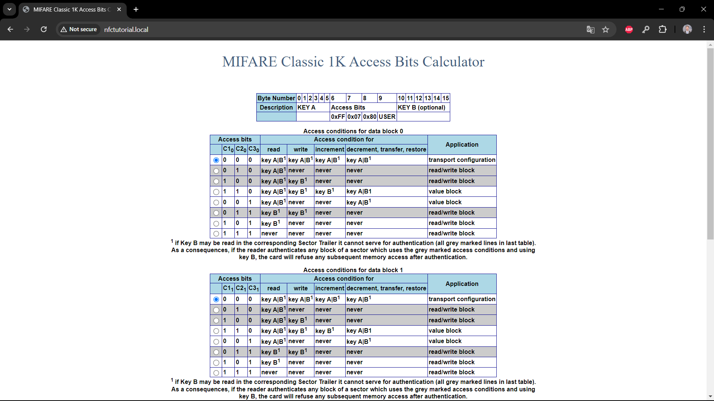</img></p></a>

If you change the position of the blue radio buttons, the access bits at the top are getting adjusted. This calculator will save you a lot of time and nerves when trying to figure out how to set the access bits properly.

### 3.4 Working With MFD Files
So far, we discussed the theory and basic terminology. Now let's get practical and [log in](#loginCommand) back into the Raspberry Pi. Navigate to your NFC folder:

		cd nfc

Copy the blank file and make yourself a sandbox:

		cp blank.mfd sandbox.mfd

Open the copied file with hexcurse:
<a name="openSandbox">

		hexcurse -r 16 sandbox.mfd

</a>

Now you can switch with <kbd>TAB</kbd> to the right side of your editor. With the arrow keys, navigate to line 5 (00000040) and type in "Hello World NFC!" This text is exactly 16 characters long and fits in one single data block. Now to save the file, hit <kbd>CTRL</kbd>+<kbd>X</kbd>, then <kbd>Y</kbd>, <kbd>ENTER</kbd>, and once again <kbd>CTRL</kbd>+<kbd>X</kbd>. Reopen the file with the [previous command](#openSandbox). Now to clear the row that you have written before, navigate with the arrow keys again to line 5 but this time in the left part of the editor. Place your cursor at the beginning of the line and hit <kbd>0</kbd> exactly 32 times. Save and close the file. Now you are able to read and manipulate the contents of a tag file. This is not intuitive and I strongly recommend to have a look at examples from the internet and also play around in the sandbox file to get a better feeling for this extraordinary data format. You might also choose another type of editor as well if you don't like hexcurse. Now we are ready to execute our first read and write operations.

### 3.5 Tag Operations
Before running the actual manipulation commands explained in the next few chapters I want you to have a look on the help section of each of them. To do so, first run the following command:

<a name="helpSectionClassic">

		nfc-mfclassic -h

</a>

The output shows you what commands are available. From my point of view, the descriptions are not very intuitive and I will therefore describe in own words how exactly to use these commands later. Now run:

		nfc-mfsetuid -h

The output is significantly shorter than the output of the previous command. Read everything carefully, and don't worry if you don't understand everything at first sight. Note that the previous command output has this line at the end:

```*** Note: this utility only works with special Mifare 1K tags (Chinese clones).```<br>

Again, changing the UID of a tag is only possible with the Chinese clones. Also double-check the version when ordering! You need the first version, because the second version of Chinese clones can only be changed with Android smartphones.

#### 3.5.1 Read a Tag
Now grab any tag of your choice. I recommend to use a Chinese clone as there is always the option to do a factory reset with those tags. If you run a faulty command on a common tag it might become corrupted and unusable. Don't waste your tags. Place the tag right beneath the PN532 module. It doesn't matter under which angle you place your tag as the reader has approximately 4cm oprating distance. Make sure you are in the "nfc" directory and run the following command:
<a name="readCommand">

		nfc-mfclassic r a u firstRead.mfd

</a>

Let the command read out the tag, it takes a few seconds. Now run:

		hexcurse -r 16 firstRead.mfd

Now you are able to see the contents of the tag. It should be empty. You can close this file with <kbd>CTRL</kbd> + <kbd>X</kbd>. The read command expects some arguments. In our example, the "r" stands for read, "a" stands for usage of Key A to read, and u for any UID that is detected. Probably you noticed that there is an option of using the arguments as uppercase letters. If we would use "R", this would mean unlocked reading and works only with Chinese clones. In other words, using "R" means bypassing key A and/or B authentication. Using an "A" means reading out tag and not terminating operation when an error occurs. This might be useful if you have a tag with a few corrupt sectors but you surely still want to read out the rest, so this is the option to go with. The argument "U" can be only used in addition with a 4 byte long UID that you provide. This is useful in very rare cases, e.g. when you have a bunch of inseparable tags and you want to address a specific one. If the lowercase "u" is provided, the tool selects the tag with lowest UID, e.g. 01234567 over 123456789 [[source]](https://manpages.debian.org/unstable/libnfc-bin/nfc-mfclassic.1.en.html). Additionally, you may have a tag that is encrypted with certain keys. In this case you would not only tell the tool how to name the output file but also provide a tag file that contains the keys. An additional argument "f" at the end may be applied if the UID of the tag file with the desired keys differs from the tag that has to be read out. We will come to that in the next chapter. Now you can also try out different variations of the [read command](#readCommand):

		nfc-mfclassic r b u firstRead.mfd
		nfc-mfclassic r A u firstRead.mfd

Try out different combinations. A read command cannot harm your tag anyway. You can also delete the file that was created previously with:

		rm firstRead.mfd

In the next chapter I will introduce the write command. We will need the read command to check whether our write operation actually did what we intended.
#### 3.5.2 Write a Tag
Now to make things a little bit more interesting, let's pretend that you want to store your [private key](https://en.bitcoin.it/wiki/Private_key) of your [cryptocurrency](https://en.wikipedia.org/wiki/Cryptocurrency) wallet on a tag of your choice. For the next steps I recommend to use a Chinese clone tag. Investigate the file ```sample_with_keys.mfd```:

		hexcurse -r 16 sample_with_keys.mfd

In lines 5 to 7 you will find a readable text on the right-hand side of your screen. If you investigate the sector trailers you will see in every line the exact same <span style="color:#F73992">Key A (1DB6261B7C)</span>, <span style="color:#7AD109">Access Bits (7F0788)</span></span>, and <span style="color:#5717F7">Key B (D43648824A42)</span>. The keys are chosen random, the access bits are set so that you can read and write everything as long as you actually have the keys. You can double-check in the [calculator](#accessBitsCalculatorInBrowser) we installed previously. Close the file with <kbd>CTRL</kbd>+<kbd>X</kbd>. We will now attempt to write this file on our blank tag. To do so, run the following command:

		nfc-mfclassic w a u sample_with_keys.mfd

The last line of the output should be the following:

		Done, 63 of 64 blocks written.

Don't worry, the skipped block was the manufacturer block. On Chinese clones you can also overwrite it by passing the capital "W". Let's try out:

		nfc-mfclassic W a u sample_with_keys.mfd

Now the output should look like this:

		Done, 64 of 64 blocks written.

In theory, we just wrote the whole contents of the ```sample_with_keys.mfd``` file to the tag. Now let's double-check if we actually did so by reading out the tag:

		nfc-mfclassic r a u doubleCheck.mfd

The command did not create any output file and the last line tells us why:

		Error: authentication failed for block 0x3f

This is because we tried to read out the tag with default keys, but we have totally random ones on our tag. To read or write a tag with specific keys you must provide a tag file that contains those. In our case we can just pass the ```sample_with_keys.mfd``` file as the keyfile argument and try the read command again:

		nfc-mfclassic r a u doubleCheck.mfd sample_with_keys.mfd

Now the last line of the output should look like this:

		Writing data to file: doubleCheck.mfd ...Done.

Open the created file with hexcurse:

		hexcurse -r 16 doubleCheck.mfd

You should see the exact same values as in the ```sample_with_keys.mfd``` file. Close the file with <kbd>CTRL</kbd>+<kbd>X</kbd>. To validate that the source and target files are actually identical, run the following command:

		sdiff doubleCheck.mfd sample_with_keys.mfd

If you don't get any output it means that the files have identical content. When reading out Chinese clone tags you must not provide a keyfile. Run the following commands one after another:

		nfc-mfclassic R a u doubleCheck.mfd
		sdiff doubleCheck.mfd sample_with_keys.mfd

The read operation was successful, ```doubleCheck.mfd``` was overwritten, and again the source and target files are identical. After we rushed through read and write commands, you are probably a little bit overwhelmed. The best thing that you can do is to try out the read and write commands with different combinations. Keep using Chinese clones! If something goes wrong and you end up with a corrupt tag that cannot be read or written, we will fix that in [3.5.5](#355-reset-a-chinese-clone-tag).
#### 3.5.3 Format a Tag
If you now want to erase all contents of your current tag, you can use the format command. The help section that we saw [here](#helpSectionClassic) suggests to run the format command twice, with key A and B. To do so, run the following commands:

		nfc-mfclassic f A u blank.mfd sample_with_keys.mfd f
		nfc-mfclassic f B u blank.mfd sample_with_keys.mfd f

You might observed that while running the first command with key A the format tool was unable to overwrite sector trailers. This is due to the access bits that I have set in the tag file. They allow to change the sector trailers with key B only. The second command was able to wipe everything except the manufacturer block. Let's check if the tag is actually blank again:

		nfc-mfclassic r a u doubleCheck.mfd

Now open the file with hexcurse:

		hexcurse -r 16 doubleCheck.mfd

The tag is empty and can be set to anything again. Remove files that we do longer need:

		rm doubleCheck.mfd sandbox.mfd

Proceed with the next chapter where we will have a closer look at the manufacturer block.
#### 3.5.4 Change Chinese Clone Tag UID
Let us recall the example with a NFC drawer mechanism from [3.1](#31-types-of-tags). Assume that you want to create a second key tag for your familiy member, friend, partnerm or whoever. You also know that the reader ignores contents of the key tag and only reads the manufacturer block. If the UID matches the expectations, the drawer opens. You also have read out your key tag previously and know that the UID is "8302C5CD". What we will do now is overwriting the default UID (01234567) with the UID that the drawer expects. To do so, place your Chinese clone tag under the PN532 module and run the following command:

		nfc-mfsetuid 8302C5CD

If you don't want your console to be flooded with detailed outputs of the command you may append the ```-q``` argument to make the output less verbose. Now to verify that the tag has actually the desired UID, run the following command:

		nfc-list

This command checks for the presence of a tag and also prints out the tag UID. Your output should look something like this:

		1 ISO14443A passive target(s) found:
		ISO/IEC 14443A (106 kbps) target:
    		ATQA (SENS_RES): 00  04
       		   UID (NFCID1): 83  02  c5  cd
      		  SAK (SEL_RES): 08

Now you can clearly see the new UID that we assigned previously. There is also the option to write the whole manufacturer block (16 bytes) with this command. To do so, I would usually let you read out the tag, copy the first line from hexcurse, but to save time I just provide you the manufacturer block in the next command:

		nfc-mfsetuid 8302C5CD890804004659255849102302 -q

This might be useful in cases where you want to create an actual identical copy of a tag. The easier way to do so is just to apply unlocked writing that I have shown in [3.5.2](#352-write-a-tag).
#### 3.5.5 Reset A Chinese Clone Tag
Now while playing around and experimenting with a tag it might happen that you accidentally write nonsense to a sector trailer and your tag becomes corrupt. There is only one questio to be asked: Is the corrupted tag a Chinese clone? If the answer is no, throw the tag away and forget about its existance. If the answer is yes, proceed. Place your desperately ill tag under the PN532 module and run the following command:

		nfc-mfsetuid -f -q

Within just a few seconds your tag should be as good as new. Be aware that this command also wipes everything that was previously written to it! There is no chance to recover the data but at least you are now left with a healthy tag. Now if you want to recover data but you have lost your key A and B, chances are very high that the next section of this tutorial will help you.
## 4 Key Recovery
### 4.1 Example Scenario
For this section we will use the scenario from [3.5.2](#352-write-a-tag) and thus the same file called file ```sample_with_keys.mfd```. This time, take any tag of your choice and place it under the PN532 module. Write the file to the tag with the following command:

		nfc-mfclassic w a u sample_with_keys.mfd

Now let's pretend that you have accidentally deleted the file ```sample_with_keys.mfd```:

		rm sample_with_keys.mfd

You remember only that you have used random keys for each and every sector. Your private key is the only access to your cryptocurrency wallet. You want to try to run the mfoc-hardnested command that attempts to reverse engineer key A and B of a MIFARE classic tag. You first run the help command to see the expected arguments:

		mfoc-hardnested -h

After reading the output carefully you then decide to run the following command:

		mfoc-hardnested -O tag_recovery.mfd

The utility first tries all standard keys and yields the following output:

		mfoc-hardnested: ERROR:
		No sector encrypted with the default key has been found, exiting..

At this point you might think that you've lost all of your crypto savings. But the truth is that it is still too early to give up. Proceed with the next chapter.
### 4.2 Brute Force and MFOC Attack
In a lot of cases a so-called [brute-force attack](https://en.wikipedia.org/wiki/Brute-force_attack) might help. It is basically trying out all possible combinations until you get the exact one that you need. In our particular case it could take several hundred years for just one single key as there are<br> 256<sup>6</sup> = 281,474,976,710,656 different combinations possible. To avoid this problem, there is a [extended standard key file](https://github.com/ikarus23/MifareClassicTool/blob/master/Mifare%20Classic%20Tool/app/src/main/assets/key-files/extended-std.keys) in the [MifareClassicTool](https://github.com/ikarus23/MifareClassicTool/tree/master) repository by [Gerhard Klostermeier](https://github.com/ikarus23). It is a Windows and Android app that allows to read and write tags. We will need the extended keys on our device. Therefore, inside your "nfc" folder, run the following command.

		wget https://raw.githubusercontent.com/ikarus23/MifareClassicTool/master/Mifare%20Classic%20Tool/app/src/main/assets/key-files/extended-std.keys

We successfully downloaded the file. It contains 1781 keys that were discovered on various different tags from all over the world. Now if we plug this file into the mfoc-hardnested command the tool will start to try out all 1781 keys on all blocks of the tag. This might take a while. To be able to close the SSH connection we will use a tool called [screen](https://wiki.debian.org/screen). It is a tool that creates a reconnectable session inside your Raspberry Pi that persists even after logout. To initialize it, simply run:

		screen

You will get a propmt with credits about the tool. Hit <kbd>ENTER</kbd>. Now, inside your screen session, run:

		mfoc-hardnested -O tag_recovery.mfd -f extended-std.keys

This will take some time. Close the screen session with <kbd>CTRL</kbd>+<kbd>A</kbd> and then press <kbd>D</kbd>. You will get an output that looks something like this:

		[detached from 985.pts-0.nfctutorial]

Remember the number that comes before ```.pts[...]```. To reattach to the session, run the following command, but use your number:

		screen -r 985

You should still see the tool running the key brute-force. This will take <b>about 2 hours</b>. Note that it is crucial to not move the tag as all of the progress will be lost if the reader cannot find the tag any longer! Detach from your screen session and logoff from your SSH shell with the following command:

		exit

Don't continue reading and return back to this point when the script has terminated.<br><br>Reconnect to your SSH shell and reattach the screen session. After termination of the recovery utility you are left with a fully restored file, but how is that possible? The explanation for this lies in the fact that I used for the last sector a different key B. You probably didn't notice the different key when exploring the file in [3.5.2](#352-write-a-tag). And this key was identical to one of the last keys in the collection of keys that we downloaded to our Raspberry Pi. Here is the interesting output part:


		[Key: b1c4a8f7f6e3] -> [................]
		[Key: 001122334455] -> [................]
		[Key: 6ca761ab6ca7] -> [...............\]
		[Key: ffffffffffff] -> [...............\]

This particular output tells us that "6CA761AB6CA7" is key B for sector 15. With this discovery we are now able to exploit sector 15. If you want to see in detail how this happens, run the following command:

		mfoc-hardnested -O tag_recovery.mfd -k 6CA761AB6CA7

In this command we additionally provide a custom key. When running the mfoc attack, the utility finds key A (1DB6261B7C1C) first, then key B (D43648824A42). Check the output file with hexcurse:

		hexcurse -r 16 tag_recovery.mfd

As you can see, the content is identical to the previously lost source file. We can rename the file back to its original name:

		mv tag_recovery.mfd sample_with_keys.mfd

The simple attack might not be sufficient for all cases. There is a much more powerful tool that we will talk about in the next chapter.
### 4.3 Hardnested MFOC Attack
Although the simple attack was able to recover both keys I suggest to try out the hardnested attack which is more complex and time-consuming. Connect to your SSH shell, and reattach to the screen session if you left it in the meanwhile. Navigate to your "nfc" folder and run the following command:

		mfoc-hardnested -O test.mfd -k 6CA761AB6CA7 -F

The ```-F``` argument forces the tool to skip the simple attack and apply the harndested attack immediately. If you leave this argument out and the simple attack fails, the tool will automatically run the hardnested attack. After a while you should see a table that looks something like this:

		time    | trg | #nonces | Activity                                                | expected to brute force
         		|     |         |                                                         | #states         | time
           -------------------------------------------------------------------------------------------------------------
		      0 |  0A |       0 | Start using 4 threads                                   |                 |
	 	      0 |  0A |       0 | Brute force benchmark: 14 million (2^23.8) keys/s       | 140737488355328 |  113d
	 	     27 |  0A |       0 | Using 235 precalculated bitflip state tables            | 140737488355328 |  113d
	 	    324 |  0A |     106 | Apply bit flip properties                               |   2081242742784 |    2d

Don't get fooled by the time estimations, the whole process may take <b>up to 20 hours!</b> There is no need in running this tool as we know that the previous method can recover both keys in a very short time. You can stop the process (or any process in Linux) with <kbd>CTRL</kbd>+<kbd>C</kbd>. Terminate the screen session with the following command:
 
		exit

Let's summarize what we have learned:
* It is a good idea to start a brute-force attack with known keys
* A simple attack is most of the times sufficient to recover all keys
* A harndested attack will probably always work but consumes a lot of time
* An attack is only possible if at least one key of any sector is known

Reminder: <b>Read the [legal disclaimer](#legalDisclaimer)!</b><br>
At this point you have obtained knowledge that helps you to understand and to work with MIFARE classic tags. This might be interesting but not really applicable in everyday life. To compensate this I prepared a whole chapter dedicated to tags that can be read by smartphones of any kind that support NFC reading.
## 5 Smartphone Tags
### 5.1 False Claims on the Internet
First thing that I want to do is to spread awareness that you shall never trust anything on the internet, perhaps not even this tutorial, question it! I asked [OpenAI's](https://openai.com/) [LLM](https://en.wikipedia.org/wiki/Large_language_model) [ChatGPT](https://chatgpt.com/) whether iPhones can read out MIFARE classic tags. You can find the detailed question and answer [here](https://chatgpt.com/share/59acec35-35fa-4627-a51c-9491d40825a5). Here is another source telling us that we cannot do this: [Blog-like article on GitHub Gist](https://gist.github.com/equipter/88d7a681bd78d45622959861cfcecf2a). No matter what you might think now, together we will proof everyone wrong. Excited? Proceed.
### 5.2 Required App NFC Tools
Apparently, blank MIFARE tags indeed are invisible to iPhones but work well with Android devices. We fill fix that. If you don't have an iPhone, this chapter is useless for you as its main focus lies on iPhone usage. See also [2.1](#21-required-hardware-and-materials). To read and write NFC tags with your iPhone we will use the [NFC Tools](https://apps.apple.com/us/app/nfc-tools/id1252962749) by [wakdev](https://www.wakdev.com/en/). Please make sure that you purchase the Pro Edition (in-app purchase) for 2,29 EUR (April 2020). With this app installed, open the app, tap the settings wheel in the upper left corner, and select "Compatibility" mode. Return to main page, and try to read an empty Chinese clone tag. Your NFC antenna is located at the top of your iPhone. It should not work. We will fix that in the next chapter.
### 5.3 Tag Preparation
Again, connect to your Raspberry Pi with the [login command](#loginCommand) and navigate to your "nfc" folder. Now it is very important to mention that the upcoming write operation will change a standard MIFARE tag <b>forever</b> to an iPhone readable tag as we are going to set the access bits so that they cannot be changed after being written once! I recommend to use a Chinese clone tag so that you always can reset the tag to its original form. Place the tag under the PN532 module and run the following command:

		nfc-mfclassic w a u blank_iPhone.mfd

If you are wondering how the written file looks like, open and investiagte it with hexcurse:

		hexcurse -r 16 blank_iPhone.mfd

After inspecting the contents, close the editor with <kbd>CTRL</kbd>+<kbd>X</kbd>. Due to lack of information I cannot explain why exactly this file works with iPhones. It just does. Open the NFC Tools app on your iPhone and try to read the tag once again. It should work and the app will display something like this:
<a name="screenshotSuccessfulRead"><p align="center">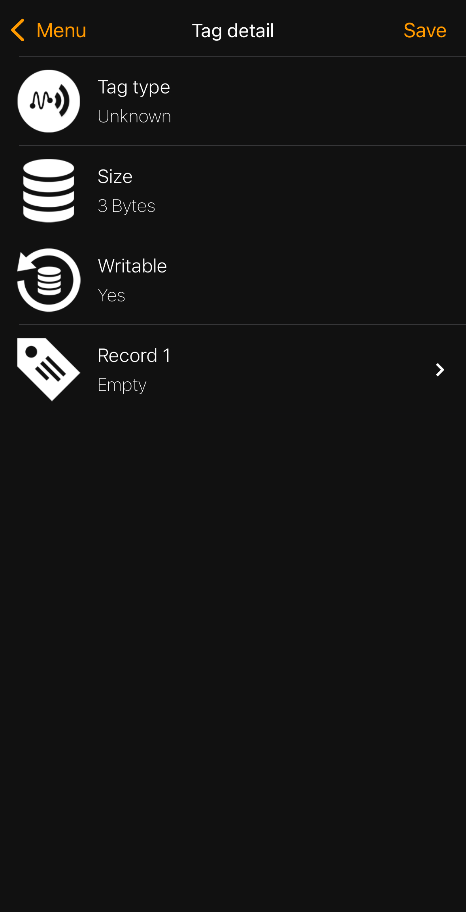</img></p></a>

Despite the common agreement on the internet that classic MIFARE tags are not readable by iPhones, we proved this to be wrong. In the next chapter we will use this to create a tag that can be read by any smartphone that supports NFC technology.
### 5.4 App Usage
In the NFC Tools app you may now tap the "Write" section. Here you have to tap "Add a record". Select anything you like from the list. I recommend trying "Social networks". Select a social network of your choice (e.g. Facebook, Instagram, GitHub, etc.), enter your username, and tap "OK". You are redirected back to the writing section. Now tap the "Write/XY Bytes" option. Approach your tag with your phone and write the data to your tag. Close the NFC Tools app and swipe it away from the opened apps. Now when you are in your home app view, approach the tag with your iPhone. Make sure you have turned on your notifications and you should see something like this appearing at the top of your screen:
<a name="screenshotTagRecognized"><p align="center">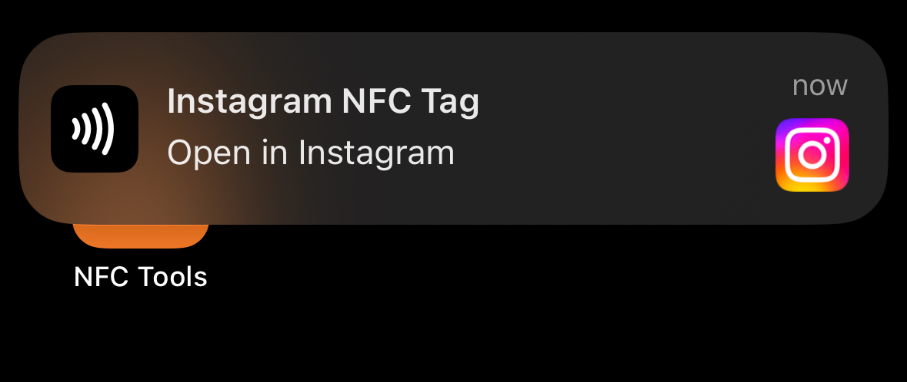</img></p></a>

In my case I made a tag with my Instagram account (which you can find at the bottom of this tutorial). If you want to erase the content of your tag, open the NFC Tools app, tap "Other", tap "Erase tag", and approach your tag. If you then read the tag, you should get the same output as in [this screenshot](#screenshotSuccessfulRead). Try out the different features of the app. At this point you have learned everything about <i>how</i> to work with NFC tags. What is left to learn is <i>when not</i> and <i>where</i> to work with NFC tags. This is covered in the remaining chapter and [section 6](#6-portability-option). Proceed reading.
### 5.5 Potential Risks
Although this chapter may sound a little boring, I still want to highlight a few potentials risks when it comes to NFC tags. First things first, <b>never store confidential data on a MIFARE tag!</b> Always remember what I have shown in [section 4](#4-key-recovery). If your tag that contains sensitive data somehow ends up being lost or stolen, your data is basically breached. Try to avoid writing such data that you would not want to share with strangers (e.g. passwords, private keys, bank account details etc.). If you recall the example usecase from [3.5.2](#352-write-a-tag), this would be a very bad idea in real life, don't do that. It is also important to mention that tags might be read by people that don't have your consent to do so. An example could be that you carry a NFC tag with your private phone number in your pocket and someone holds a phone against your pocket and reads out the tag without you even noticing it. This scenario is unlikely to happen but to be safe from data theft I heavily recommend to carry tags in a wallet with NFC protection. Almost any modern wallet has this as you already carry at least 2-3 NFC tags in form of your credit card, your passport, health insurance card, or anything you can imagine. Of course credit cards use standards of NFC chips that cannot be read easily by everyone, but remember the human spirit, and a wallet that simply blocks the corresponding electromagnetic waves is a very robust and effective solution against NFC data theft. Also note that, according to the discussion in [3.1](#31-types-of-tags), <b>you can never rely on the uniqueness of a tag!</b> Oftentimes tags can be cloned easily, so make sure to double-check tags (such as access or balance cards) on their genuitiy. Do this with simple visual checks and what is actually printed or (hand)written on a tag. Another important point is that whenever you find a lost NFC tag, <b>don't try to access its contents!</b> Either bring it back to the owner if information on the tag itself is printed or dispose it properly. Stay legal! Don't break laws. You are now aware of some potential risks, do's, and dont's. The only thing left to do is to provide you another degree of freedom and that is the possibility to do all of the contents presented here anywhere you want. You will be no longer binded to your home WiFi and computer. Continue reading.
## 6 Portability Options
### 6.1 Portable Setup
All of the tools presented in [section 3](#3-basic-nfc-knowledge) and [4](#4-key-recovery) can be used anywhere and anytime. To try out the mobile setup, grab your powerbank, wires, your iPhone, a tag of your choice, and either turn off your home WiFi or go to another place where your Rapberry Pi won't be able to connect to the network. Connect your powerbank to your Raspberry Pi power port. My setup looks like this:
<a name="mySetup"><p align="center">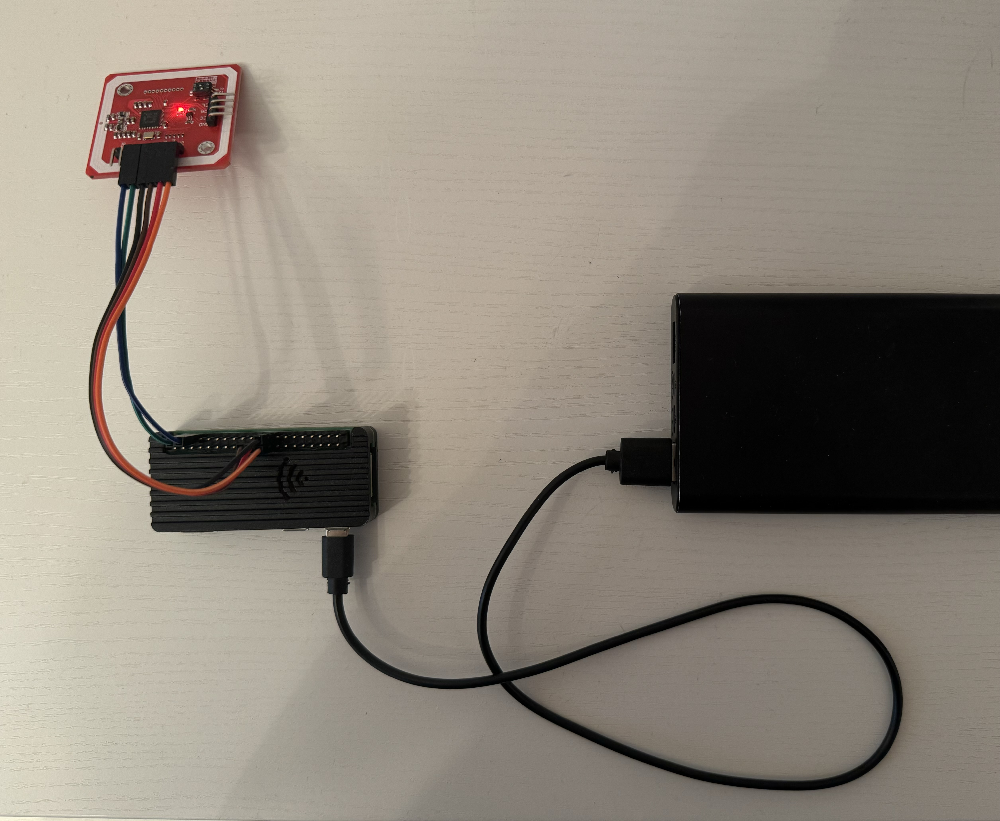</img></p></a>

In my case, the whole setup (including powerbank) weights 310g which is a lightweight solution and having a powerbank with a capacity of 10,000mAh will be sufficient to power the Raspberry Pi for at least 7 hours. When idle, the Raspberry Pi Zero 2W consumes about 350mAh and this number increases with rising computational demand. Now with the device powered on, grab your iPhone and open your WiFi settings. Tap "Other..." and enter the hotspot details that you have set [here](#hotspotSetup) earlier. Select "WPA2/WPA3" for security type if not selected by default. Tap "Join". Now your WiFi settings should display something like this:
<a name="mySetup"><p align="center">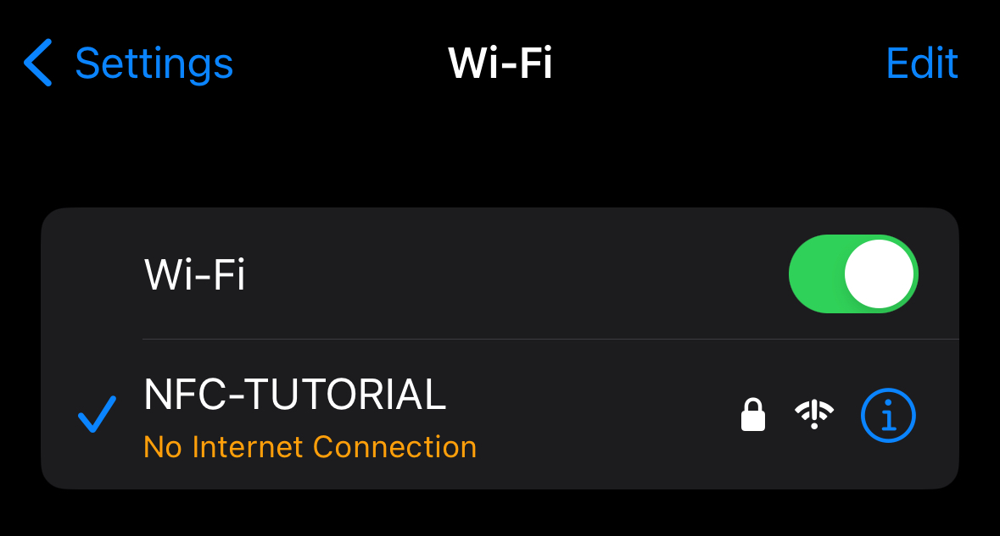</img></p></a>

If you succeeded in connecting to the hotspot of your Raspberry Pi you may now disconnect and connect your iPhone back to your regular home network or use cellular data. If the connection was unsuccessful there might be two options:
* Your Raspberry Pi is still connected to your home network
* You did an error during setup in [2.4](#24-raspberry-pi-configuration)

Usually the network manager of Raspberry Pi works very reliable. It is also possible to just reboot the device by plugging out the power supply and plugging it in again (not recommended).
### 6.2 Recommended Apps
To work with the Raspberry Pi I recommend using two apps:
* [WebSSH](https://apps.apple.com/us/app/webssh-sysadmin-tools/id497714887) by [MENGUS ARNAUD](https://apps.apple.com/us/developer/mengus-arnaud/id461353964)
* [Net Analyzer](https://apps.apple.com/us/app/network-analyzer-net-tools/id562315041) by [Techet](https://apps.apple.com/us/developer/techet/id401457168)

There are also other SSH and networking apps that are sutiable and for free. WebSSH Pro costs 4,49 EUR (March 2021) and Net Analyzer Pro costs 3,99 EUR (May 2024). I heavily recommend to use these apps because I have tested them thoroughly and must say that they are excellent. With the apps installed, you may now proceed to the last chapter of this section.
### 6.3 Usage Examples
In the following I will show some examples of what and how can be done on your iPhone to run all possible commands that you have learned previously. This time I decided to make more visual explanations with screenshots and GIF's.
#### 6.3.1 Access Bits Calculator in Safari
With your iPhone connected to the Raspberry Pi hotspot, open the [Safari](https://www.apple.com/safari/) browser and type in the hostname of your Raspberry Pi followed by ```.local```, just as in the [login command](#loginCommand). Tap "go". You should see something like this:
<a name="accessBitsCalculatorInSafari"><p align="center">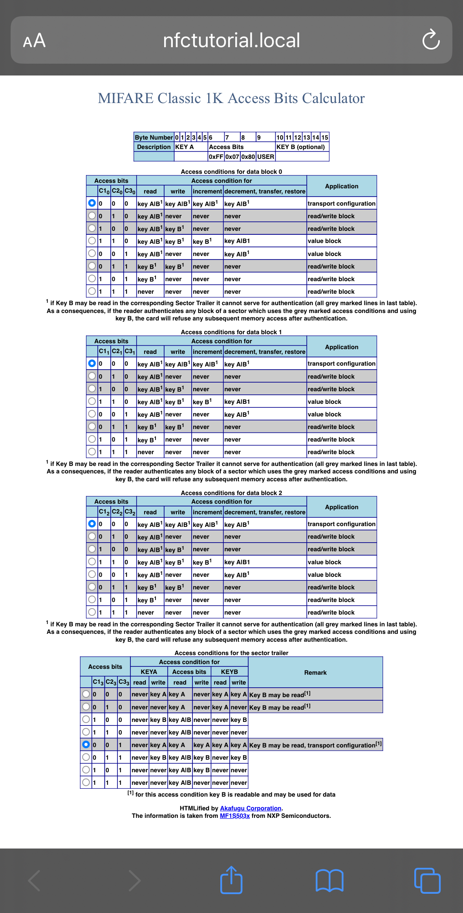</img></p></a>

You can use the calculator on your iPhone just like we saw in [3.3](#33-access-bits-calculator).
#### 6.3.2 Working with WebSSH
Open the WebSSH app. In the section "Servers", add your Raspberry Pi by tapping the "+" icon. Don't use the hostname, use ```10.42.0.1``` instead! Also set the port to 22. Your configuration should look something like this:
<a name="webSSHConfigurationWindow"><p align="center">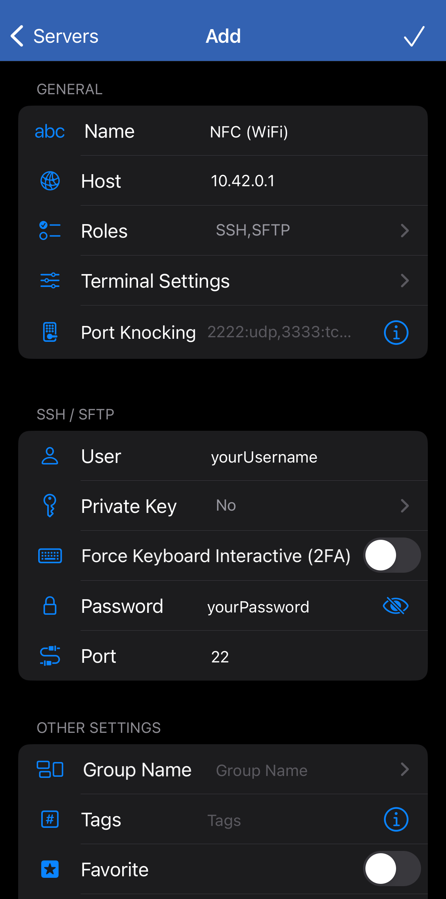</img></p></a>

Tap the checkmark. Now you may connect. If there will be a pop-up with a scary warning, tap the red option "Continue anyway". Here is an example of me connecting, reading a tag, looking at the contents with hexcurse, deleting the file, and closing the connection:
<a name="webSSHUsage"><p align="center"></img></p></a>

Here is an example of how to use the [SFTP](https://en.wikipedia.org/wiki/SSH_File_Transfer_Protocol) connection to transfer files between your iPhone and Raspberry Pi:
<a name="SFTPUsage"><p align="center"></img></p></a>

All of these things work completely offline and don't require an internet connection. 
#### 6.3.3 Sharing Cellular Internet via USB
In some cases you might want to either update your whole Raspberry Pi or install additional packages. Therefore you need an internet connection. The easiest way is to share your iPhone's cellular data via USB. First you have to connect your iPhone with your Raspberry Pi. It should look something like this:
<a name="usbHotspotSetup"><p align="center">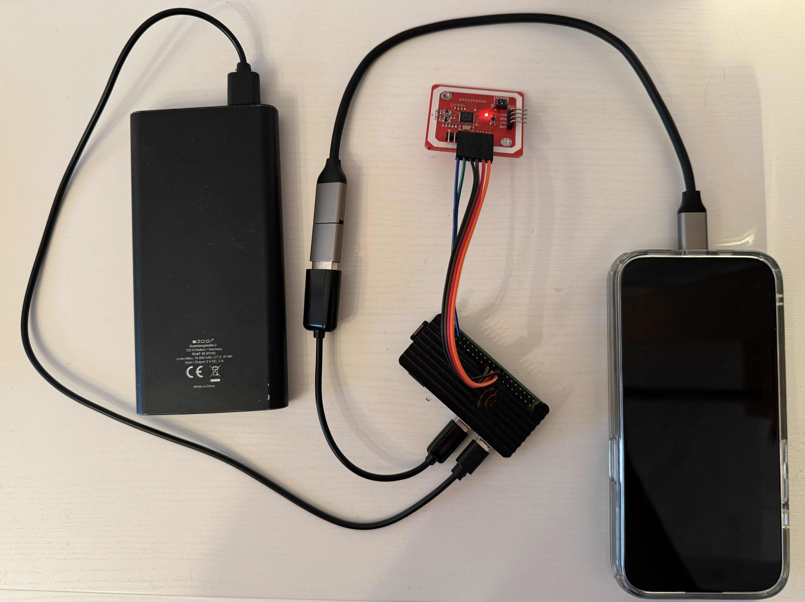</img></p></a>

Note that you have to connect your iPhone to the data port of the Raspberry Pi. Now you need to grant internet access in your iPhone settings. In case your iPhone asks whether to trust the device, tap "Trust" and authenticate if necessary. Then, go to your settings, and apply following settings in "Personal Hotspot" section:
<a name="shareHotspotViaUSB"><p align="center"></img></p></a>

After this a green double-loop-like icon should appear at the top of your iPhone screen. If this icon appears, your Raspberry Pi has established a connection to the internet successfully. Now to find out the local IP address of your device you have to scan IP addresses in the range ```172.20.10.2 - 172.20.10.255```. This is the address pool that iPhones use by default for USB tethering. You can run an IP range scan in the Net Analyzer app:
<a name="scanIPRange"><p align="center"></img></p></a>

You should get similar results. The cyan "W" icon tells us that the pinged device has a website available, which is the access bits calculator in our case. Remember the IP address and create a new entry in WebSSH, just as shown [here](#webSSHConfigurationWindow). Now to test if the Raspberry Pi can actually access the internet, run the following command in your WebSSH session:

		ping -c 3 google.com

You should see something like this:
<a name="pingGoogle"><p align="center"></img></p></a>

At this point you have finished reading the main content of this guide. Time to draw conclusions.
## 7 Conclusion
The presented knowledge and methods in this tutorial help to understand the general idea of how NFC tags work and how to handle them with the help of different devices. After going through all chapters, you have a fully functional DIY NFC reader/writer, an idea of how data is stored on MIFARE classic tags, how to read, write, format, and recover tags. You can do everything in this tutorial in any corner of this world (and even beyond) with the help of a portable setup. I still want to highlight some drawbacks of this tutorial. Even though all parts seem to be cheap, you still have to invest a two-digit amount of money (2024) if you don't have any of the mentioned [hardware](#21-required-hardware-and-materials). The explained knowledge only helps to understand the basic principles and I do not provide extensive technical details. Although this was not the scope, I still recommend to read or watch about how NFC works on a physical level to understand the beauty behind this invention. So far, we have covered only the MIFARE classic standard which is outdated since about 2008. It is still in use, but there are more efficient and more secure NFC tags already available for not too much money. We installed an efficient offline access bits calculator, but we are still missing the option of calculating in the reverse direction, from access bits to human-readable conditions. I think this tutorial is an acceptable entry point for those who want to learn about NFC tags in a practical and applicable way (e.g. kids, students, teachers, etc.), but is not sufficient to make someone a domain expert. Nevertheless, when I started working with NFC tags I was totally lost and didn't know where to start. This guide shall, in addition to provided knowledge, also save time, nerves, and hundreds of open [StackOverflow](https://stackoverflow.com/) tabs in your browser. I hope that this tutorial has met your expectations and you could learn something new!
## 8 Suggestions and Improvments
I am always glad to receive any type of constructive criticism. Therefore, feel free to open an issue [here](https://github.com/smolinde/nfc-tutorial/issues/new) with your thoughts, comments, or questions. Please note that I don't want to expand the knowledge in this tutorial to keep things as easy as possible. However, you might see this different and if you think that something really important is missing, feel free to [fork this repository](https://github.com/smolinde/nfc-tutorial/fork) and expand it.<br><br>
<p align="center"><a href="https://www.linkedin.com/in/smolinde/"></img></a> <a href="https://www.instagram.com/smolinde/"></img></a> <a href="https://www.duscloud.eu/sites/about/sub"></img></a></p>