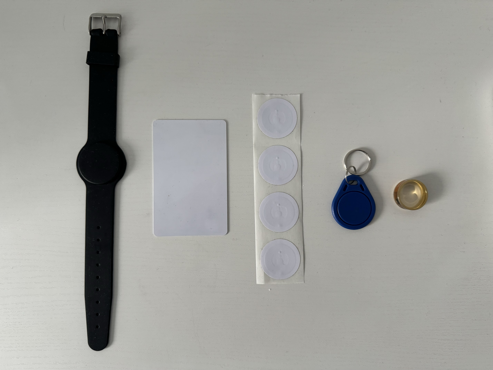

# NFC Tutorial
<i>A full practical guide for classic NFC tags</i>

## 1 Introduction

NFC (Near-Field Communication) is a variety of communication protocols between two electronic devices over a short distance, usually less than 4cm.<sup>[[1]](https://en.wikipedia.org/wiki/Near-field_communication)</sup> We usually know NFC as a helpful technology when it comes to access control or contactless payment like [Google Pay](https://pay.google.com/about/) or [Apple Pay](https://www.apple.com/apple-pay/). There are a lot of different usecases where NFC is applied, and there is also a large variety of protocol standards. A very famous and wide-spread standard is the [MIFARE Classic](https://www.mifare.net/en/products/chip-card-ics/mifare-classic/). An advantage of MIFARE cards is that they are incredibly cheap and can be read by all possible devices. A drawback is that this protocol is very well examined and is no longer secure. In case you want to use NFC tags for storing confidential information, it is a very bad choice to use MIFARE tags. There are better and more secure tags available, such as [NTAG215](https://www.nxp.com/products/rfid-nfc/nfc-hf/ntag-for-tags-and-labels/ntag-213-215-216-nfc-forum-type-2-tag-compliant-ic-with-144-504-888-bytes-user-memory:NTAG213_215_216) cards. Although newer and better standards already exist, MIFARE tags are still used by a large number of companies and facilities.<br><br>
In this tutorial I will explain how to work practically with MIFARE cards. We will learn how to set up a DIY card reader and writer device, what MIFARE cards to use, how to manipulate contents of a card, and how to create fancy contact cards that can be read by all kinds of smartphones, including [Apple's iPhones](https://www.apple.com/iphone/).

## 2 DIY NFC Reader/Writer
### 2.1 Required Hardware and Materials
Let us start with some important physical requirements. Here is a list of hardware that we will use in this tutorial:
 * A Raspberry Pi Zero 2W with case and GPIO pins soldered
 * A case for your Raspberry Pi
 * A smartphone of your choice with mobile internet access
 * A computer/laptop of your choice
 * A 32GB nano SD card with suitable adapter for your computer
 * A power adapter with micro-USB (male)
 * A PN532 reader/writer module with pins soldered
 * Six female-to-female jumper wires (>10cm recommended)
 * A paper clip
 * A USB-A (female) to micro-USB (male) adapter
 * A smartphone wire that has a USB-A (male) connector
 * A powerbank (5V~1,2A with 10,000mAh recommended)
 * A wire with micro-USB (male) and an end that fits your powerbank
 * A wireless home network (2.4GHz)
 * Blank MIFARE tags of your choice
 * At least one new MIFARE chinese clone tag with changeable UID
 * A soldering kit

### 2.2 Hardware Setup 
With everything at hand, let's start with the Raspberry Pi. Such set costs about 40 EUR (May 2024). I recommend [this seller on Amazon](https://www.amazon.de/stores/page/DDE68FC9-D2C7-464C-86A6-40A35B195E1B). The PN532 module comes usually with pins, MIFARE cards, and jumper wires. You can order it from [AliExpress](https://www.aliexpress.com/w/wholesale-pn532.html?spm=a2g0o.detail.search.0). There is a wide range of offers, find one that you like. One important thing to mention is that most times the seller includes only 4 jumper wires. If you use the [I2C protocol](https://en.wikipedia.org/wiki/I%C2%B2C) it works with only 4. However, using 6 together with the [SPI protocol](https://en.wikipedia.org/wiki/Serial_Peripheral_Interface) singificantly increases operating speed which will be extremely important when running key recovery later. Therefore I recommend to find a seller that will send you 6 or buy jumper wires on [AliExpress](https://www.aliexpress.com/w/wholesale-jumper-wire.html?spm=a2g0o.productlist.search.0). If you have no soldering kit at home, consider buying [this one](https://aliexpress.com/item/1005006842091809.html).<br>

Now that we have everything, let us begin with the hardware preparation. Solder the GPIO pins to the Raspberry Pi, install the case, and solder the pins on the PN532 chip. Now grab your jumper wires and connect the PN532 module to the Raspberry Pi as shown below:<br>
<a name="wiring"><p align="center"></img></p></a>

Note that you have to change the position of the onboard switches to set the PN532 module to SPI. The black arrow in the image points on the switch block. The light yellow color in the diagram switch block is the switch position. First, remove the foil that is usually above the switches on new modules, then, with help of a paper clip, change the position of the switch. <b>Be careful, don't apply too much force!</b> Now check if you unplugged your soldering iron and continue with the software part.

### 2.3 Operating System Setup

Now to install the right operating system (OS) we have to download the [Raspberry Pi Imager](https://www.raspberrypi.com/software/). Open it on your PC and plug in your SD card. Now, select the device, in our case Raspberry Pi Zero 2W. For operating system, go to "Raspberry Pi OS (other)" > "Raspberry Pi OS Lite (32bit)". In storage part, select your SD card that you have plugged in before. Hit "NEXT". Now choose "EDIT SETTINGS". Here you can select a name for your Raspberry, your username and password, and set up your WiFi home network. Make sure you fill in the correct SSID and PSK (WiFi name and password), else you will have to do everything all over again. It should look something like this:<br>
<a name="configurationOS"><p align="center"></img></p></a>

Hit "SAVE" and then "YES", and again "YES". At this point, say goodbye to everything that was stored previously on the SD card and wait until the program finishes the flash process. After termination, plug out the SD card and plug it into the Raspberry Pi. Now if you recall the [wiring diagram](#wiring), plug in your power supply into the <b>micro-USB port on the right!</b> The left port is for data transfer. Wait a few minutes. A green LED should be flashing in your Raspberry Pi and a red LED should be shining on the PN532 module. Make sure your computer is connected to the same network as your Raspberry Pi. Open a command line of your choice (I prefer using [Microsoft PowerShell](https://learn.microsoft.com/en-us/powershell/)). Now, let's take the credentials that I've chosen in [my configuration](#configurationOS) and try to connect the very first time via [SSH](https://en.wikipedia.org/wiki/Secure_Shell):

<a name="loginCommand">

		ssh smolinde@nfctutorial.local

</a>

The shell will prompt some security information. Ignore it, type in "yes" and hit <kbd>ENTER</kbd>. Now type in your password. Don't worry, although no letters appear on the screen, you are typing. After entering the password, hit <kbd>ENTER</kbd> again. Your screen should look something like this:<br>
<a name="firstShellLogin"><p align="center"></img></p></a>

Congratulations! You have now a running omnipotent computer.

### 2.4 Raspberry Pi Configuration
Before installing all required components to work with NFC cards we first have to do some steps to ensure that the Raspberry Pi is set up correctly to work as expected. A golden rule is to run the following command right after the first login:

		sudo apt update -y && sudo apt full-upgrade -y

Wait until the updates are installed. Now we have to do the following things:
* Enable SPI
* Expand file system
* Create a Hotspot
* Add 4GB of SWAP memory

Type the following command in your command line and hit <kbd>ENTER</kbd>:

		sudo raspi-config

With arrow keys, navigate to "3 Interface Options", hit <kbd>ENTER</kbd>, navigate to "I3 SPI", and hit <kbd>ENTER</kbd> again. Select "\<Yes\>", hit <kbd>ENTER</kbd> two times. Now navigate to "6 Advanced Options", hit <kbd>ENTER</kbd>, now you should select "A1 Expand Filesystem" with <kbd>ENTER</kbd> again. Wait a little bit, hit <kbd>ENTER</kbd> after the file system was resized. Now hit the <kbd>TAB</kbd> key two times and <kbd>ENTER</kbd> to finish, save, and close Raspberry Pi configuration GUI. It will ask you whether you would like to reboot, hit <kbd>ENTER</kbd> to do so. Now wait a few moments until the Raspberry Pi reboots. Repeat the [login command](#loginCommand). Now we are going to set up the wireless hotspot that will be activated when your home network is out of reach. This will allow you to connect to the device anywhere from any device (later more). To do so, run the following command and replace "MyNetworkName" and "MySecurePassword" with a WiFi network name and a password of your choice:

		sudo nmcli dev wifi hotspot ifname wlan0 ssid "MyNetworkName" password "MySecurePassword"

The shell will disconnect immediately. Go to your computers WiFi settings, find the new network, and connect with the chosen password. After this, run the [login command](#loginCommand) in your command line again. Now you can run:

		sudo nmcli con edit Hotspot

Inside of here, run the following commands:

		set connection.autoconnect yes
		set connection.autoconnect-priority -10
		set 802-11-wireless.hidden yes

Now type and run "save", type "yes" if asked, and "quit" to leave editing window. Now run:

		sudo nmcli con mod "preconfigured" connection.autoconnect-priority 10

This ensures that your home WiFi will be preferred and the Hotspot will be activated if and only if there is no other network in reach. You have to do this only once unless you decide to change your WiFi network properties. In that case you can always edit the existing connection (e.g. changing the password). I also recommend to hide the hotspot so that if you are using it somewhere else, people will not really see the additional existing network that is broadcasted by your Raspberry Pi. Now for key recovery we have to add a bit of RAM to our system, which is possible with [SWAP memory paging](https://en.wikipedia.org/wiki/Memory_paging). Run the following commands:

		sudo fallocate -l 4G /swapfile
		sudo chmod 600 /swapfile
		sudo mkswap /swapfile
		sudo swapon /swapfile

Now also edit the following configurato file with:

		sudo nano /etc/fstab

At the bottom of this file, paste the following line:

		/swapfile swap swap defaults 0 0

Press <kbd>CTRL</kbd>+<kbd>O</kbd>, <kbd>ENTER</kbd>, and then <kbd>CTRL</kbd>+<kbd>X</kbd> to save and close the file. Now also open the following file:

		sudo nano /etc/sysctl.conf

At the bottom of this file, paste the following line:

		vm.swappiness=100

Press <kbd>CTRL</kbd>+<kbd>O</kbd>, <kbd>ENTER</kbd>, and then <kbd>CTRL</kbd>+<kbd>X</kbd> to save and close the file. Reboot the Raspberry Pi via:

		sudo reboot now

Wait until the process is finished and continue with the software setup section.

### 2.5 Software Setup
For now, we have successfully prepared the hardware and Raspberry Pi configurations. Now we have to install and configure software components that we will use throughout this tutorial. The following command will do most of the work:

		sudo apt install screen git libnfc-dev libnfc-bin hexcurse autotools-dev autoconf libtool libusb-dev liblzma-dev ipheth-utils -y

After installing all new components, edit the following file with:

		sudo nano /etc/nfc/libnfc.conf

At the bottom of this file, paste the following two lines:

		device.name = "PN532 Reader (SPI)"
		device.connstring = "pn532_spi:/dev/spidev0.0:50000"

Press <kbd>CTRL</kbd>+<kbd>O</kbd>, <kbd>ENTER</kbd>, and then <kbd>CTRL</kbd>+<kbd>X</kbd> to save and close the file. The previous step ensures that the [libnfc](https://nfc-tools.github.io/projects/libnfc/) tools find the SPI hardware address of the PN532 module and are able to communicate through this channel. At this point it makes sense to check whether we can actually access and use the PN532 module. To do so, run the following command:

		sudo nfc-list

The output should look something like this:

		nfc-list uses libnfc 1.8.0
		NFC device: PN532 Reader (SPI) opened

The version might be newer. If you see this output, then everything works as expected and soon you will be able to run your very first read/write commands! If the output yields errors or something else, go through all previous steps I have described so far or open !HERE! an issue if you are really stuck. Else continue with the installation of the key recovery tool. Run the following commands:

		git clone https://github.com/nfc-tools/mfoc-hardnested.git && cd mfoc-hardnested
		autoreconf -vis
		./configure
		make && sudo make install
		cd .. && sudo rm -r mfoc-hardnested

These commands will install the desired recovery tool called [mfoc-hardnested](https://github.com/nfc-tools/mfoc-hardnested). At this point it is time for a legal disclaimer:


<b>THE METHODS PRESENTED BELOW ARE ONLY TO BE USED WITH OWN TAGS AND SHALL NEVER BE USED TO GAIN ILLEGAL ACCESS TO INFORMATION STORED ON TAGS THAT BELONG TO OTHERS THAN YOU. THE AUTHOR OF THIS TUTORIAL DOES NOT CARRY ANY RESPONSIBILITY IF THE BELOW LISTED METHODS ARE APPLIED IN UNLAWFUL WAYS. USE WITH CAUTION. USE AT YOUR OWN RISK AND INFORM YOURSELF ABOUT LOCAL LEGAL REGULATIONS.</b>

With this being said, we can now have a deeper look into the methods of how to read, write, format, and recover MIFARE classic cards.

## 3 Basic NFC Knowledge

### 3.1 Types of Cards
Before we begin to explore various commands, let's have a look at what types of cards exist out there. The MIFARE classic card usually can store 1024 [bytes](https://en.wikipedia.org/wiki/Byte) of data and is therefore called 1K card. There are also cards that can store 2K or even 4K of information, but they are hardly ever used because the information stored on such cards is most of the times very compact and takes only a small percentage of the whole capacity of a 1K card. These cards are manufactured in a large variety of forms, such as classic credit card sized tags, stickers, bracelets, keyrings, wearable rings, and many more. The image below shows my collection of tags:
<a name="cardCollection"><p align="center"></img></p></a>

A questions that begs to be answered now is how do systems distingush the cards one from another. Here is an example; Assume you have a key cards that allows you to open a [NFC drawer](https://aliexpress.com/w/wholesale-nfc-drawer-lock.html?spm=a2g0o.home.search.0) at your home. How to ensure that if you clone a card the drawer mechanism is still able to recognize that the presented key cards is a clone and not the original? The answer to this question is a bit complicated, so let me break it down into a few bullet points:
* Each classic card has a unique manufacturer ID assigned to it
* This ID cannot be modified
* Additionally to the ID there is even more unchangeable data
* This makes cards very distinguishable
* If the ID is 4 [hex](https://en.wikipedia.org/wiki/Hexadecimal) bytes long, there are 255<sup>4</sup> = 4,288,250,625 different ID's
* This is roughly one card per two people on this planet (2024)
* If the ID is 7 hex bytes long, there are 255<sup>7</sup> = 70,110,209,207,109,375 different ID's
* This is quite a lot and would really solve the uniqueness issue
* There are so-called [Chinese clone cards](https://aliexpress.com/w/wholesale-chinese-clone-cards.html?spm=a2g0o.productlist.search.0) that allow to write any ID onto the card
* This mechanism completely destroys the uniqueness of cards
* This issue can be partially circumvented by readers by checking if the ID is rewritable
* There are cards that can get any chosen ID that cannot be changed afterwards
* The uniqueness of MIFARE cards is therefore not existing

I think this is an interesting observation. It reflects the human spirit of circumventing anything that was invented for a good purpose.

### 3.2 Data Storage and Structure
To better understand what actually is inside the tag we will talk about a bunch of terms:
* Constant and rewritable UID
* Sector
* Block
* Key A and key B
* Access bits
* Sector trailer

There are many more terms like BCC, SAK, ATQA, etc. We will only use the very basic terminology to keep things as easy as possible. Before I start to explain what each term means, let's have a look on an example of how data on a 1K chip actually looks like. To do so, go back to you Raspberry Pi, log in, and run the following command:

		mkdir nfc && exit 0

On your "Desktop" environment you just created a folder called "nfc". Inside of this folder you can store any NFC-related material to avoid chaos. Now donwload the two files [blank.mfd]() and [blank_iPhone.mfd]() that are provided in the folder "templates" of this repository. Inside your command line, run the following command and replace the information so that it aligns with your data paths, Raspberry Pi username, and password:

		scp "Your/Path/To/blank.mfd" yourusername@yourhostname.local:/home/yourusername/nfc
		scp "Your/Path/To/blank_iPhone.mfd" yourusername@yourhostname.local:/home/yourusername/nfc

Both times you will be asked to type in your password. The [scp](https://en.wikipedia.org/wiki/Secure_copy_protocol) command allows you to transfer files from A to B securely. This is what we also have done. Now, [log in](#loginCommand) back to your Raspberry Pi, navigate inside the "nfc" folder, and open the blank dummy file:

		cd nfc
		hexcurse -r 16 blank.mfd

You should see now something like this:
<a name="hexcurseBlankCard"><p align="center"></img></p></a>

We use the ```-r 16``` argument to reshape the file so that exactly 16 bits per row are displayed. Explore the file with up and down arrow keys. The very first line is the block 0, the so-called manufacturer block. Here 01234567 is the 4 byte UID of the chip. That thing is sometimes 7 bytes long. It cannot be really distinguished by just looking at it. But later when reading a chip you will get the UID always displayed separately, so this is how you know then how long the UID actuall is. Further you may observe that there are tons of zeros. That is because the file is a blank card with almost no content. Why almost? Let's talk about the key blocks and what sectors are. I took an image from a repository by [Pavel Zhovner](https://github.com/zhovner) - [mfread](https://github.com/zhovner/mfdread). Check it out, he has written a nice script for opening card files that also highlights keys and access bits with colors. Also the repository contains very detailed technical knowledge of the single components inside a card file.
<a name="sampleFileColored"><p align="center"></img></p></a>

In the image above we see that a sector contains 4 blocks. There is a total of 16 sectors (0 to 15) inside a MIFARE classic 1K card and 16 × 4 = 64 blocks (0 to 63) in total. As said previously, block 0 contains the UID and manufacturer data. On regular cards, we cannot change this block no matter what we do. However, if we take a Chinese clone card, we can rewrite the block 0 as often as we want (later more). In each fourth block we see the so-called sector trailer that contains <span style="color:#F73992">Key A</span>, <span style="color:#7AD109">Access Bits</span>, and <span style="color:#5717F7">Key B</span>. The access bits are there to tell the reader what it can or can't do with the sector. Note that only the first three hex bits are used for access condition encoding, the last bit can be set to anything (user bit). You can find [here](http://calc.gmss.ru/Mifare1k) a simple online tool that encodes access conditions into three bits. The keys on the other hand may or may not be required to either read or write to the single blocks of a sector. You can set the access bits very individual depending on your usecase. For example, if you want to create a sector that shall be read-only with both keys at hand, your access condition would be <span style="color:#7AD109">70F87800</span>. Key A and Key B can be generated randomly. To do so, you can use a webtool such as [this one](https://www.browserling.com/tools/random-hex). Set the amount of digits to 12 and results to 2 and you will receive two random keys that you might want to apply to your tag sector. The beauty of [hexcurse](https://github.com/LonnyGomes/hexcurse) by [Lonny Gomes](https://github.com/LonnyGomes) is that you can write a plaintext in the editor on the right-hand side and it will automatically encode it on the left-hand side to hexadecimal bits. This is also very helpful vice versa, when you open a card file, you may see encoded information as plaintext. You should try this out.

### 3.3 Working With MFD Files
So far, we discussed the theory and basic terminology. Now let's get practical and [log in](#loginCommand) back into the Raspberry Pi. Navigate to your NFC folder:

		cd nfc

Copy the blank file and make yourself a sandbox:

		cp blank.mfd sandbox.mfd

Open the copied file with hexcurse:
<a name="openSandbox">

		hexcurse -r 16 sandbox.mfd

</a>

Now you can switch with <kbd>TAB</kbd> to the right side of your editor. With the arrow keys, navigate to line 5 (00000040) and type in "Hello World NFC!" This text is exactly 16 characters long and fits in one single data block. Now to save the file, hit <kbd>CTRL</kbd>+<kbd>X</kbd>, then <kbd>Y</kbd>, <kbd>ENTER</kbd>, and once again <kbd>CTRL</kbd>+<kbd>X</kbd>. Reopen the file with the [previous command](#openSandbox). Now to clear the row that you have written before, navigate with the arrow keys again to line 5 but this time in the left part of the editor. Place your cursor at the beginning of the line and hit <kbd>0</kbd> exactly 32 times. Save and close the file. Now you are able to read and manipulate the contents of a card file. This is not intuitive and I strongly recommend to have a look at examples from the internet and also play around in the sandbox file to get a better feeling for this extraordinary data format. You might also choose another type of editor as well if you don't like hexcurse. Now we are ready to execute our first read and write operations.

### 3.4 Tag Operations

#### 3.4.1 Read a Tag

#### 3.4.2 Write a Tag

#### 3.4.3 Format a Tag

#### 3.4.4 Change Chinese Clone Tag UID

#### 3.4.5 Reset A Chinese Clone Tag

## 4 Key Recovery

### 4.1 Brute Force Known Keys

### 4.2 Simple MFOC Attack

### 4.3 Hardnested MFOC Attack

## 5 Smartphone Cards

### 5.1 Card Preparation

### 5.2 Smartphone App Usage

### 5.3 Usage and Risks

## 6 Portability Options

### 6.1 Recommended Apps

### 6.2 Portable Device Setup

### 6.3 Usage Examples

## 7 Conclusion
The presented knowledge and methods in this tutorial help to understand the general idea of how NFC tags work and how to handle them with the help of different devices. After going through all chapters, you have a fully functional DIY NFC reader/writer, an idea of how data is stored on MIFARE classic cards, how to read, write, format, and recover tags. You can do everything in this tutorial in any corner of this world (and even beyond) with the help of a portable setup. I still want to highlight some drawbacks of this tutorial. Even though all parts seem to be cheap, you still have to invest a two-digit amount of money (2024) if you don't have any of the mentioned [hardware](#2.1). The explained knowledge only helps to understand the basic principles and I do not provide extensive technical details. Although this was not the scope, I still recommend to read or watch about how NFC works on a physical level to understand the beauty behind this invention. So far, we have covered only the MIFARE classic standard which is outdated since about 2008. It is still in use, but there are more efficient and more secure NFC tags already available for not too much money. I think this tutorial is an acceptable entry point for those who want to learn about NFC tags in a practical and applicable way (e.g. kids, students, teachers, etc.), but is not sufficient to make someone a domain expert. Nevertheless, when I started working with NFC tags I was totally lost and didn't know where to start. This guide shall, in addition to provided knowledge, also save time, nerves, and hundreds of open [StackOverflow](https://stackoverflow.com/) tabs in your browser. I hope that this tutorial has met your expectations and you could learn something new!
## 8 Suggestions and Improvments
I am always glad to receive any type of constructive criticism. Therefore, feel free to open an issue [here]() with your thoughts, comments, or questions. Please note that I don't want to expand the knowledge in this tutorial to keep things as easy as possible. However, you might see this different and if you think that something really important is missing, feel free to [fork this repository]() and expand it.<br><br>
<p align="center"><a href="https://www.linkedin.com/in/smolinde/"></img></a> <a href="https://www.instagram.com/smolinde/"></img></a> <a href="https://www.duscloud.eu/sites/about/sub"></img></a></p>